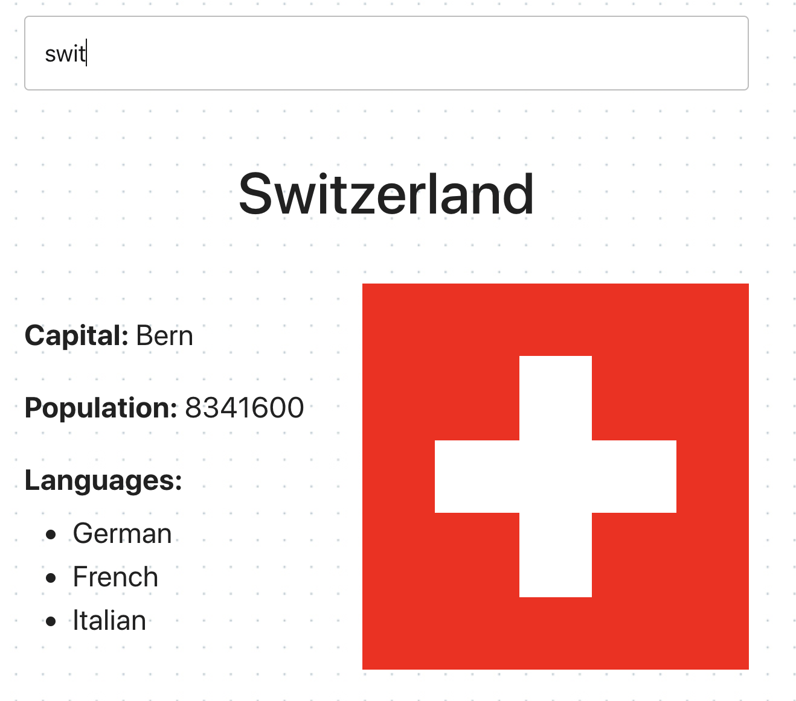
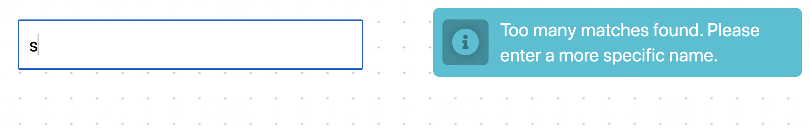
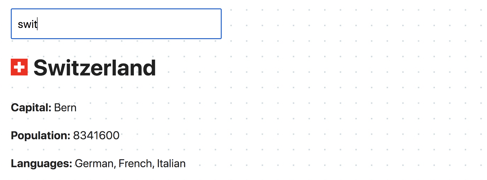
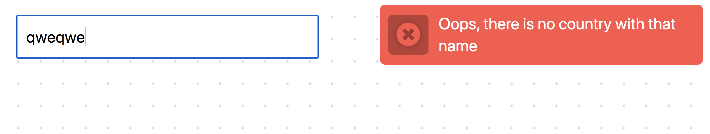

# goit-Js-hw-12-countries

## Parcel boilerplate


## Поиск стран

Небольшое приложение поиска данных о стране по ее частичному или полному
имени. Используя [Rest Countries API](https://restcountries.com/), а именно
вторую версию (v2) и ендпоинт
[/name](https://restcountries.com/#api-endpoints-v3-name), возвращающий массив
объектов стран попавших под критерий поиска.

Достаточно чтобы приложение работало для большинства стран. Некоторые страны,
такие как `Sudan`, могут создавать проблемы, поскольку название страны является
частью названия другой страны, `South Sudan`. Не нужно беспокоиться об этих
исключениях.

Интерфейс очень простой. Название страны для поиска пользователь вводит в
текстовое поле.

⚠️ **ВНИМАНИЕ!** HTTP-запросы на бекенд происходят не по сабмиту формы, формы
нет, а при наборе имени страны в инпуте, то есть по событию `input`. Но делать
HTTP-запрос при каждом нажатии клавиши нельзя, так как одновременно получится
много HTTP-запросов которые будут выполняться в непредсказуемом порядке (race
conditions). Поэтому на обработчик события необходимо применить подход
`debounce` и делать HTTP-запрос спустя `500мс` после того, как пользователь
перестал вводить текст. Используй npm-пакет
[lodash.debounce](https://www.npmjs.com/package/lodash.debounce).

Если бекенд вернул больше чем 10 стран подошедших под критерий введенный
пользователем, в интерфейсе отображается нотификация о том, что необходимо
сделать запрос более специфичным. Для оповещений используй плагин
[pnotify](https://github.com/sciactive/pnotify).


Если бекенд вернул от 2-х до 10-х стран, под инпутом отображается список имен
найденных стран.


Если бекенд вернул массив с одной страной, в интерфейсе рендерится разметка с
данными о стране: название, столица, население, языки и флаг.



====================================================================================

## Задание - поиск стран

Создай фронтенд часть приложения поиска данных о стране по её частичному или
полному имени. Используй публичный API
[Rest Countries](https://restcountries.eu/), а именно
[ресурс name](https://restcountries.com/#api-endpoints-name), возвращающий массив
объектов стран удовлетворивших критерий поиска. Добавь минимальное оформление
элементов интерфейса.


### HTTP-запрос

Напиши функцию `fetchCountries(name)` которая делает HTTP-запрос на
[ресурс name](https://restcountries.com/#api-endpoints-name) и возвращает промис
с массивом стран - результатом запроса. Вынеси её в отдельный файл
`fetchCountries.js` и сделай именованный экспорт.

### Фильтрация полей

В ответе от бэкенда возвращаются объекты, большая часть свойств которых тебе не
пригодится. Чтобы сократить объем передаваемых данных добавь строку параметров
запроса - так этот бэкенд реализует фильтрацию полей. Ознакомься с
[документацией синтаксиса фильтров](https://restcountries.com/#filter-response).

Тебе нужны только следующие свойства:

- `name` - полное имя страны
- `capital` - столица
- `population` - население
- `flag` - ссылка на изображение флага
- `languages` - массив языков

### Поле поиска

Название страны для поиска пользователь вводит в текстовое поле
`input#search-box`. HTTP-запросы выполняются при наборе имени страны, то есть по
событию `input`. Но, делать запрос при каждом нажатии клавиши нельзя, так как
одновременно получится много запросов и они будут выполняться в непредсказуемом
порядке.

Необходимо применить приём `Debounce` на обработчике события и делать
HTTP-запрос спустя `300мс` после того, как пользователь перестал вводить текст.
Используй пакет
[lodash.debounce](https://www.npmjs.com/package/lodash.debounce).

Если пользователь полностью очищает поле поиска, то HTTP-запрос не выполняется,
а разметка списка стран или информации о стране пропадает.

Выполни санитизацию введенной строки методом `trim()`, это решит проблему когда
в поле ввода только пробелы или они есть в начале и в конце строки.

### Интерфейс

Если в ответе бэкенд вернул больше чем 10 стран, в интерфейсе пояляется
уведомление о том, что имя должно быть более специфичным. Для уведомлений
используй [библиотеку notiflix](https://github.com/notiflix/Notiflix#readme) и
выводи такую строку
`"Too many matches found. Please enter a more specific name."`.



Если бэкенд вернул от 2-х до 10-х стран, под тестовым полем отображается список
найденных стран. Каждый элемент списка состоит из флага и имени страны.


Если результат запроса это массив с одной страной, в интерфейсе отображается
разметка карточки с данными о стране: флаг, название, столица, население и
языки.



> ⚠️ Достаточно чтобы приложение работало для большинства стран. Некоторые
> страны, такие как `Sudan`, могут создавать проблемы, поскольку название страны
> является частью названия другой страны, `South Sudan`. Не нужно беспокоиться
> об этих исключениях.

### Обработка ошибки

Если пользователь ввёл имя страны которой не существует, бэкенд вернёт не пустой
массив, а ошибку со статус кодом `404` - не найдено. Если это не обработать, то
пользователь никогда не узнает о том, что поиск не дал результатов. Добавь
уведомление `"Oops, there is no country with that name"` в случае ошибки
используя [библиотеку notiflix](https://github.com/notiflix/Notiflix#readme).



> ⚠️ Не забывай о том, что `fetch` не считает 404 ошибкой, поэтому необходимо
> явно отклонить промис чтобы можно было словить и обработать ошибку.

====================================================================================

Проект собран с помощью
  [parcel-project-template](https://github.com/goitacademy/parcel-project-template).
- Для HTTP запросов использована библиотека [axios](https://axios-http.com/).
- Используется синтаксис `async/await`.
- Для уведомлений использована библиотека
  [notiflix](https://github.com/notiflix/Notiflix#readme).
- Код отформатирован `Prettier`.

# Задание - поиск изображений

Создай фронтенд часть приложения поиска и просмотра изображений по ключевому
слову. Добавь оформление элементов интерфейса. Посмотри демо видео работы
приложения.

https://user-images.githubusercontent.com/17479434/125040406-49a6f600-e0a0-11eb-975d-e7d8eaf2af6b.mp4

## Форма поиска

Форма изначально есть в HTML документе. Пользователь будет вводить строку для
поиска в текстовое поле, а при сабмите формы необходимо выполнять HTTP-запрос.

```html
<form class="search-form" id="search-form">
  <input
    type="text"
    name="searchQuery"
    autocomplete="off"
    placeholder="Search images..."
  />
  <button type="submit">Search</button>
</form>
```

## HTTP-запросы

В качестве бэкенда используй публичный API сервиса
[Pixabay](https://pixabay.com/api/docs/). Зарегистрируйся, получи свой
уникальный ключ доступа и ознакомься с документацией.

Список параметров строки запроса которые тебе обязательно необходимо указать:

- `key` - твой уникальный ключ доступа к API.
- `q` - термин для поиска. То, что будет вводить пользователь.
- `image_type` - тип изображения. Мы хотим только фотографии, поэтому задай
  значение `photo`.
- `orientation` - ориентация фотографии. Задай значение `horizontal`.
- `safesearch` - фильтр по возрасту. Задай значение `true`.

В ответе будет массив изображений удовлетворивших критериям параметров запроса.
Каждое изображение описывается объектом, из которого тебе интересны только
следующие свойства:

- `webformatURL` - ссылка на маленькое изображение для списка карточек.
- `largeImageURL` - ссылка на большое изображение.
- `tags` - строка с описанием изображения. Подойдет для атрибута `alt`.
- `likes` - количество лайков.
- `views` - количество просмотров.
- `comments` - количество комментариев.
- `downloads` - количество загрузок.

Если бэкенд возвращает пустой массив, значит ничего подходящего найдено небыло.
В таком случае показывай уведомление с текстом
`"Sorry, there are no images matching your search query. Please try again."`.
Для уведомлений используй библиотеку
[notiflix](https://github.com/notiflix/Notiflix#readme).

## Галерея и карточка изображения

Элемент `div.gallery` изначально есть в HTML документе, и в него необходимо
рендерить разметку карточек изображений. При поиске по новому ключевому слову
необходимо полностью очищать содержимое галереи, чтобы не смешивать результаты.

```html
<div class="gallery">
  <!-- Карточки изображений -->
</div>
```

Шаблон разметки карточки одного изображения для галереи.

```html
<div class="photo-card">
  
  <div class="info">
    <p class="info-item">
      <b>Likes</b>
    </p>
    <p class="info-item">
      <b>Views</b>
    </p>
    <p class="info-item">
      <b>Comments</b>
    </p>
    <p class="info-item">
      <b>Downloads</b>
    </p>
  </div>
</div>
```

## Пагинация

Pixabay API поддерживает пагинацию и предоставляет параметры `page` и
`per_page`. Сделай так, чтобы в каждом ответе приходило 40 объектов (по
умолчанию 20).

- Изначально значение параметра `page` должно быть `1`.
- При каждом последующем запросе, его необходимо увеличить на `1`.
- При поиске по новому ключевому слову значение `page` надо вернуть в исходное,
  так как будет пагинация по новой коллекции изображений.

В HTML документе уже есть разметка кнопки при клике по которой необходимо
выполнять запрос за следующей группой изображений и добавлять разметку к уже
существующим элементам галереи.

```html
<button type="button" class="load-more">Load more</button>
```

- Изначально кнопка должна быть скрыта.
- После первого запроса кнопка появляется в интерфейсе под галереей.
- При повторном сабмите формы кнопка сначала прячется, а после запроса опять
  отображается.

В ответе бэкенд возвращает свойство `totalHits` - общее количество изображений
которые подошли под критерий поиска (для бесплатного аккаунта). Если
пользователь дошел до конца коллекции, пряч кнопку и выводи уведомление с
текстом `"We're sorry, but you've reached the end of search results."`.

## Дополнительно

> ⚠️ Следующий функционал не обязателен при сдаче задания, но будет хорошей
> дополнительной практикой.

### Уведомление

После первого запроса при каждом новом поиске выводить уведомление в котором
будет написано сколько всего нашли изображений (свойство `totalHits`). Текст
уведомления `"Hooray! We found totalHits images."`

### Библиотека `SimpleLightbox`

Добавить отображение большой версии изображения с библиотекой
[SimpleLightbox](https://simplelightbox.com/) для полноценной галереи.

- В разметке необходимо будет обернуть каждую карточку изображения в ссылку, как
  указано в документации.
- У библиотеки есть метод `refresh()` который обязательно нужно вызывать каждый
  раз после добавления новой группы карточек изображений.

Для того чтобы подключить CSS код библиотеки в проект, необходимо добавить еще
один импорт, кроме того который описан в документации.

```js
// Описан в документации
import SimpleLightbox from 'simplelightbox';
// Дополнительный импорт стилей
import 'simplelightbox/dist/simple-lightbox.min.css';
```

### Прокрутка страницы

Сделать плавную прокрутку страницы после запроса и отрисовки каждой следующей
группы изображений. Вот тебе код подсказка, а разберись в нём самостоятельно.

```js
const { height: cardHeight } = document
  .querySelector('.gallery')
  .firstElementChild.getBoundingClientRect();

window.scrollBy({
  top: cardHeight * 2,
  behavior: 'smooth',
});
```

### Бесконечный скролл

Вместо кнопки «Load more» можно сделать бесконечную загрузку изображений при
прокрутке страницы. Мы предоставлям тебе полную свободу действий в реализации,
можешь использовать любые библиотеки.

===============================================================================

## Перед началом работы

Один раз на проект установить все зависимости.

```shell
npm ci
```

### Разработка

Запустить режим разработки. Во вкладке браузера перейти по адресу [http://localhost:1234](http://localhost:1234).

```shell
npm run dev
```

### Деплой

Сборка будет автоматически собирать и деплоить продакшен версию проекта на GitHub Pages, в ветку
`gh-pages`, каждый раз когда обновляется ветка `main`. Например, после прямого пуша или принятого
пул-реквеста. Для этого необходимо в файле `package.json` отредактировать поле `homepage` и скрипт
`build`, заменив `имя_пользователя` и `имя_репозитория` на свои.

```json
"homepage": "https://имя_пользователя.github.io/имя_репозитория",
"scripts": {
  "build": "parcel build src/*.html --public-url /имя_репозитория/"
},
```

На всякий случай стоит зайти в настройки репозитория `Settings` > `Pages` и убедиться что файлы раздаются из папки `/root` ветки `gh-pages`.

Через какое-то время живую страницу можно будет посмотреть по адресу указанному в отредактированном
свойстве `homepage`, например
[https://goitacademy.github.io/parcel-project-template](https://goitacademy.github.io/parcel-project-template).

### Файлы и папки

- Все паршалы файлов стилей должны лежать в папке `src/sass` и импортироваться в
  `src/sass/main.scss`
- Изображения добавляйте в папку `src/images`, заранее оптимизировав их. Сборщик просто копирует
  используемые изображения чтобы не нагружать систему оптимизацией картинок, так как на слабых
  компьютерах это может занять много времени.
